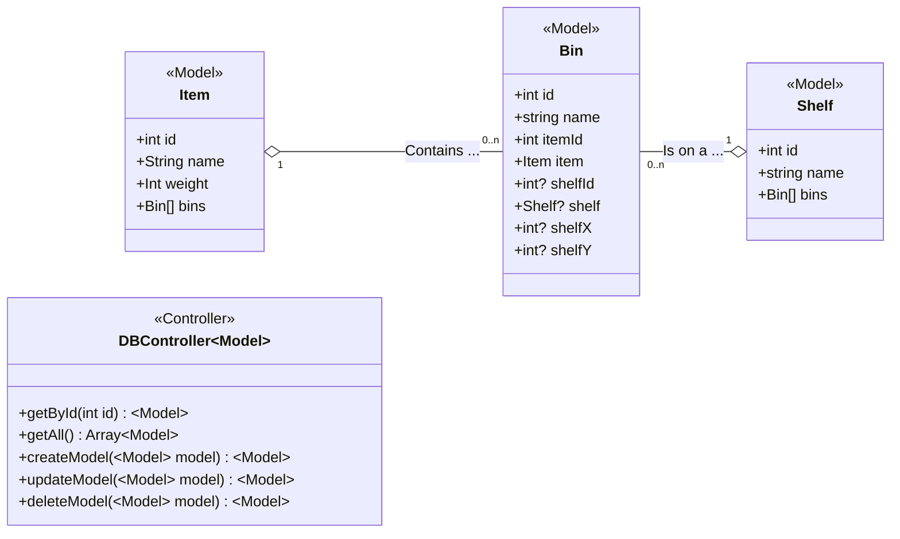

# Class diagram:

```mermaid
classDiagram
direction LR

Item "1" o-- "0..n" Bin : Contains ...
Bin "0..n" --o "1" Shelf : Is on a ...

class Item {
  <<Model>>

  +int id
  +String name
  +Int weight
  +Bin[] bins
}

class Bin {
  <<Model>>

  +int id   
  +string name 

  +int itemId 
  +Item item   
  
  +int? shelfId 
  +Shelf? shelf   
  
  +int? shelfX  
  +int? shelfY  
}

class Shelf {
  <<Model>>

  +int id
  +string name
  +Bin[] bins
}

class DBController~Model~ {
  <<Controller>>

  +getById(int id) ~Model~
  +getAll() Array~Model~
  +createModel(~Model~ model) ~Model~
  +updateModel(~Model~ model) ~Model~
  +deleteModel(~Model~ model) ~Model~
}

```